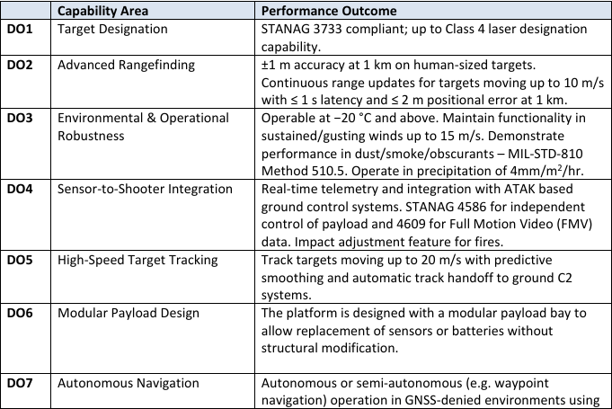

# True North Precision: Low cost drones with laser ranging

> **Source:** IDEaS Defence Innovation Portal — Challenge page
> (`defence-innovation-portal.my.site.com`), copied 2026-05-31 into `idea/`.
> This file consolidates the portal text (`idea/idea.md`) plus the five embedded
> images, which have been transcribed inline and are also linked at the bottom
> for verification.
>
> **Supported by:** Bureau of Research, Engineering and Advanced Leadership in
> Innovation and Science (**BOREALIS**).
>
> **Program / solicitation (public record):** IDEaS **Competitive Projects** —
> first challenge under the Canadian Army **MINERVA Initiative**. Tender
> **`W7714-248676/012`** (CanadaBuys + MERX). Challenge pool **$2.1 M total**
> across all awards (per-project guidance ≈ $300K). **Proposal deadline 2026-06-10
> 14:00 EDT** (MERX /012; verify in guide). Components (standard IDEaS): 1a TRL 1–3
> ≤$250K ≤6 mo · 1b TRL 4–5 ≤$1.5M ≤12 mo · 2 TRL 6–9 ≤$5M. Test-ready by **spring 2027**.
> Eligible: individuals, academia, not-for-profit, gov, all industry. Apply via
> the **Solicitation Guide on CanadaBuys** (authoritative for criteria/deadline —
> not yet retrieved; see `08-OPEN-QUESTIONS.md` Q1).

---

## Challenge Statement

The Department of National Defence (DND) and the Canadian Armed Forces (CAF) are seeking innovative solutions for cost-effective uncrewed aerial systems (UAS) to provide accurate range and target cueing information to support indirect fire missions and battlefield awareness. Current systems either lack the precision and resilience required for use in contested electromagnetic environments or are prohibitively expensive for widespread deployment.

---

## Background and Operational Context

Modern battlefield environments present significant challenges for tactical Intelligence, Surveillance, and Reconnaissance (ISR) operations, particularly at the platoon and company levels. While advanced ISR platforms offer exceptional performance, their high cost, export restrictions, and sustainment complexity limit their scalability and accessibility for frontline units. Conversely, small commercial drones, though affordable and widely available, lack the geolocation precision required to support sensor-to-shooter integration and effective fire mission coordination.

Canadian and allied forces currently rely on a polarized mix of ISR capabilities: low-cost quadcopters for short-range reconnaissance and high-end Class 2 systems for more complex missions. This polarization has created a capability gap in the mid-tier range, specifically, the absence of affordable, durable ISR drones that can deliver precise rangefinding and target cueing under contested electromagnetic conditions.

To address this gap, there is a need for compact, low-power, and ruggedized rangefinding or target designation payloads that can be integrated into small ISR drones.

The initial operational focus is on supporting mortar and artillery observers by providing accurate range and geolocation data to improve calls for fire, enabling observers to operate from protected positions. Once validated, the system could be scaled to support mounted reconnaissance teams, partner force augmentation, and networked fires coordination across combined arms teams.

---

## Validation, Refinement, and User Engagement Activities

As part of this Challenge, structured user engagement and iterative capability development activities will be integrated into the contract period to support solution maturation and ensure alignment with CAF operational needs.

A **mid-point Capability Validation and Refinement Activity** is expected to be scheduled approximately **three to four months after contract award**. This activity will be conducted over several consecutive days and will bring together all participating innovators to assess progress achieved to that point through hands-on testing.

The Capability Validation and Refinement Activity is intended to enable iterative, collaborative engagement between innovators and CAF end-users. During this period, innovators will have the opportunity to test and present their evolving solutions, receive direct operational feedback, and make adjustments or refinements in response. Follow-on testing and exchanges during the same activity window will allow innovators to validate refinements and engage in further technical and operational discussions, helping to inform priorities for the next development sprint.

At the conclusion of the contract period, a **Final Capability Assessment Activity** will be conducted and DND/CAF will provide feedback. This activity will assess the overall maturity, performance, and operational relevance of proposed solutions against the Challenge outcomes.

The timing, location, and detailed format of all activities will be communicated at a later date.

> As there are a variety of strategies and methods that could be proposed for meeting this challenge, DND/CAF is providing some guidance to innovators based on the current state of this capability domain and experiences with similar projects:

### Proposal Activity Budget Guidance

*(transcribed from `idea/rtaImage (4).jpeg`)*

| Examples of Proposal Activities | Typical Budgets are Approximate |
|---|---|
| Integration of Technologies onto Existing UAS Platforms | $100,000.00 |
| Mid-Point Capability Validation | $20,000.00 |
| Development and Refinement of UAS Technologies | $160,000.00 |
| Assessment Activity of Capabilities | $20,000.00 |
| **Total for all Proposal Activities** | **$300,000.00** |

---

## Essential Outcomes

Proposed solutions **must** demonstrate the following:

*(transcribed from `idea/rtaImage (3).jpeg` and `idea/rtaImage (2).jpeg`)*

| # | Capability Area | Performance Outcome |
|---|---|---|
| **EO1** | Precision Rangefinding | ±2 m range accuracy at 1 km to a vehicle-sized target (10 figure Military Grid Reference System (MGRS)). Continuous range updates for targets moving up to 10 m/s with ≤ 1 s latency and ≤ 2 m positional error at 1 km. |
| **EO2** | Platform Performance | Must fall within operational radius of 3–4 km (Line of Sight (LOS) or Beyond Visual Line of Sight (BVLOS) with waiver); ≥ 30 minutes endurance under standard conditions. |
| **EO3** | Resilience & Navigation | Maintain rangefinding/geolocation capability during Global Navigation Satellite System (GNSS) degradation; provide a fallback navigation (e.g., visual odometry, inertial fusion, Real-Time Kinematic correction). |
| **EO4** | Environmental & Operational Robustness | Operable at 0 °C and above. Maintain functionality in sustained/gusting winds up to 10 m/s. Demonstrate performance of target acquisition in presence of dust/smoke/obscurants (e.g. MIL-STD-810 Method 510.5 compliance). |
| **EO5** | Data Handling & Safety | Class 1 eye-safe laser operation for rangefinder and information handling compliant with ITSP.10.171. |
| **EO6** | Size | Integrated system including drone and sensor payload must not weigh more than 25 kg. |
| **EO7** | Operational Testing | A prototype of the innovative solution will be ready for a final capability assessment activity to be held in **May 2027**. |

---

## Additional Challenge Information — Desired Outcomes

Proposed solutions **should** include capabilities and considerations such as, but not limited to, the following:

*(transcribed from `idea/rtaImage.jpeg` and `idea/rtaImage (1).jpeg`)*

| # | Capability Area | Performance Outcome |
|---|---|---|
| **DO1** | Target Designation | STANAG 3733 compliant; up to Class 4 laser designation capability. |
| **DO2** | Advanced Rangefinding | ±1 m accuracy at 1 km on human-sized targets. Continuous range updates for targets moving up to 10 m/s with ≤ 1 s latency and ≤ 2 m positional error at 1 km. |
| **DO3** | Environmental & Operational Robustness | Operable at −20 °C and above. Maintain functionality in sustained/gusting winds up to 15 m/s. Demonstrate performance in dust/smoke/obscurants — MIL-STD-810 Method 510.5. Operate in precipitation of 4 mm/m²/hr. |
| **DO4** | Sensor-to-Shooter Integration | Real-time telemetry and integration with ATAK based ground control systems. STANAG 4586 for independent control of payload and 4609 for Full Motion Video (FMV) data. Impact adjustment feature for fires. |
| **DO5** | High-Speed Target Tracking | Track targets moving up to 20 m/s with predictive smoothing and automatic track handoff to ground C2 systems. |
| **DO6** | Modular Payload Design | The platform is designed with a modular payload bay to allow replacement of sensors or batteries without structural modification. |
| **DO7** | Autonomous Navigation | Autonomous or semi-autonomous (e.g. waypoint navigation) operation in GNSS-denied environments using multiple alternative navigation methods (e.g., visual odometry, inertial fusion). Front facing automated obstacle avoidance. |
| **DO8** | Origin | The countries of origin for critical systems, including data transmission devices, flight controllers, software and onboard computers are clearly identified. |
| **DO9** | EM Resilience | Fibre optic wire or alternate non-Electromagnetic (EM) spectrum means of control and data transfer from Ground Control Station (GCS) to air vehicle. Remote extension of GCS transmitter from operator. |

---

## NATO UAS Class Definitions (used for this challenge)

*(transcribed from `idea/rtaImage (1).jpeg`)*

| Class | Category | Normal Operating Altitude above ground-level (AGL) | Normal Mission Radius | NATO Example Platform |
|---|---|---|---|---|
| **Class I** (<150 kg) | Micro (<2 kg) | Up to 200 ft AGL | 5 km (line of sight (LOS)) | Wasp, Snipe |
| | Mini (2–20 kg) | Up to 3000 ft AGL | 25 km (LOS) | Raven, Puma |
| | Small (>20 kg) | Up to 5000 ft AGL | 50 km (LOS) | Blackjack |
| **Class II** (150–600 kg) | Tactical | Up to 10,000 ft AGL | 200 km (LOS) | S-100 Camcopter |

---

## Embedded source images

The original challenge page embeds five images (Salesforce rich-text exports,
saved with `.jpeg` extensions but actually PNG). Each is transcribed above; they
are linked here for verification.

| File | Dimensions | Content |
|---|---|---|
| `idea/rtaImage (4).jpeg` | 678 × 122 | Proposal Activity Budget guidance table |
| `idea/rtaImage (3).jpeg` | 681 × 241 | Essential Outcomes EO1–EO3 |
| `idea/rtaImage (2).jpeg` | 680 × 279 | Essential Outcomes EO4–EO7 (with EO3 continuation line) |
| `idea/rtaImage.jpeg` | 681 × 455 | Desired Outcomes DO1–DO7 |
| `idea/rtaImage (1).jpeg` | 685 × 462 | Desired Outcomes DO8–DO9 + NATO UAS Class table |

.jpeg>)
.jpeg>)
.jpeg>)

.jpeg>)
